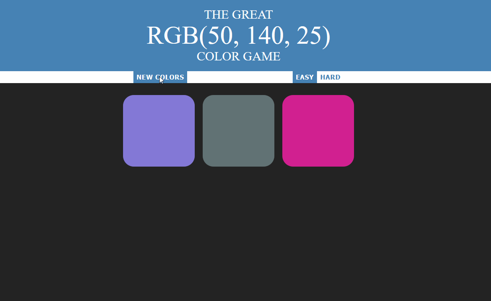
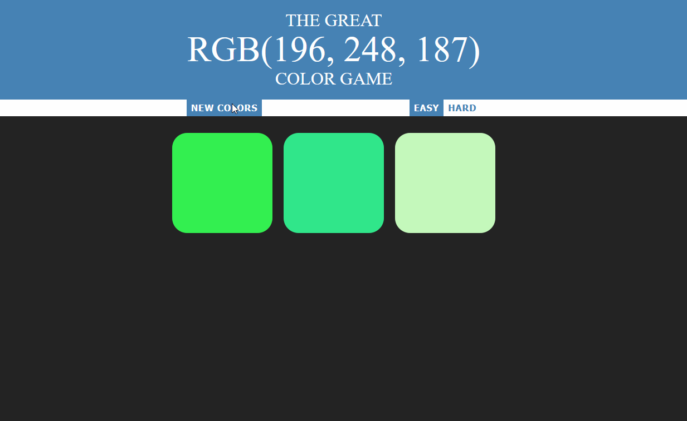
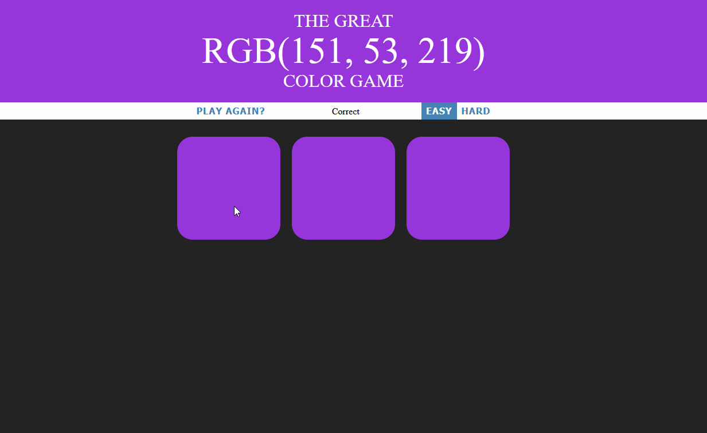

# Color-Game
==============

Will become a sub heading
--------------

Second sub heading
--------------

*This will be Italic*

**This will be Bold**

- This will be a list item
- This will be a list item

    Add a indent and this will end up as code
